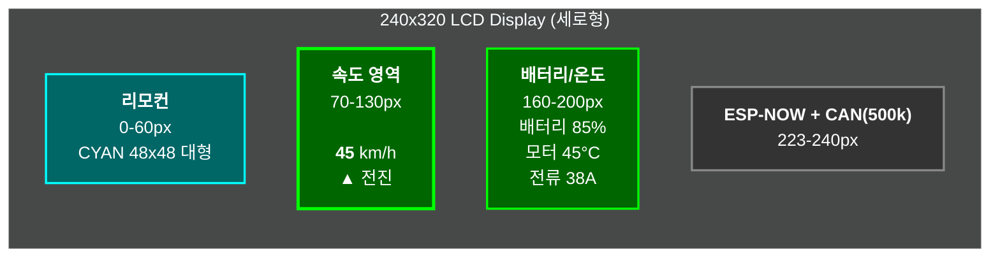

# ESP32 리모컨 UI 디자인

## 📱 메인 화면 레이아웃 (240x320 세로형)

### ASCII 버전 (텍스트 에디터용)
```
0 →  ╔══════════════════════════╗
     ║                          ║
10→  ║       리 모 컨           ║  (한글 48x48 대형)
     ║                          ║
60→  ╠══════════════════════════╣
     ║                          ║
70→  ║      속도 (km/h)         ║
     ║                          ║
90→  ║         45               ║  (숫자 72pt 초대형)
     ║                          ║
130→ ║      ▲ 전진              ║  (방향 표시)
     ║                          ║
150→ ╠══════════════════════════╣
     ║                          ║
160→ ║  배터리                  ║
170→ ║  ████████░░ 85%          ║  (대형 진행바)
     ║                          ║
190→ ║  모터: 45°C  FET: 52°C   ║
200→ ║  전류: 38A               ║
     ║                          ║
220→ ╠══════════════════════════╣
230→ ║ 연결: 연결됨  RSSI: -45  ║
     ║                          ║
250→ ╠══════════════════════════╣
260→ ║ 설정: SEL+LT+RT 1초      ║
280→ ║ ESP-NOW + CAN(500k)      ║
320→ ╚══════════════════════════╝
     (폭: 240px)
```

### Mermaid 다이어그램 버전 (렌더링용)


## 🎨 색상 구성

### 배경 및 기본
- **배경**: BLACK (0x0000)
- **제목**: CYAN (0x07FF) - "리모컨" (48x48)
- **구분선**: GRAY (0x8410)

### 속도 표시 (핵심)
- **속도 숫자**: GREEN (0x07E0), **72pt 초대형** (3~4배)
- **라벨**: WHITE (0xFFFF), 16pt
- **방향 아이콘**:
  - 정지: ● YELLOW (0xFFE0)
  - 전진: ▲ GREEN (0x07E0)
  - 후진: ▼ RED (0xF800)

### 차량 상태
- **배터리 진행바**: 
  - 80% 이상: GREEN (0x07E0)
  - 50~80%: YELLOW (0xFFE0)
  - 50% 미만: RED (0xF800)
  - 높이: 20px (기존 15px → 대형화)
- **온도 표시**:
  - 정상: WHITE (0xFFFF)
  - 경고(80°C+): YELLOW
  - 위험(90°C+): RED
- **전류**: CYAN (0x07FF)
- **연결 상태**:
  - 연결됨: GREEN
  - 대기중: GRAY
- **RSSI**:
  - -50dBm 이상: GREEN
  - -50~-70dBm: YELLOW
  - -70dBm 이하: RED

## 🔤 폰트 사용

### 한글 (16x16 조합형)
- **제목**: 2배 확대 (32x32) - "리모컨"
- **일반 텍스트**: 1배 (16x16)
  - "설정모드: SEL+LT+RT 1초"
  - "속도:", "배터리:", "연결:", "신호:"
  - "정지", "전진", "후진"
  - "연결됨", "대기중"

### 영문/숫자 (8x16 or Adafruit)
- **버튼 레이블**: "UP", "DN", "LT", "RT", "SEL"
- **숫자**: 속도, 배터리 퍼센트
- **기타**: "km/h", "dBm", "ESP-NOW + CAN(500k)"

## 📍 주요 좌표

### 헤더
```cpp
// 제목 "리모컨" (중앙 정렬)
x=70, y=10, 한글 48x48 (3배 확대)
```

### 속도 영역 (메인 디스플레이)
```cpp
// 라벨 "속도 (km/h)"
x=70, y=70, 한글 16x16

// 속도 숫자 (초대형)
x=90, y=90, 크기 4배 (72pt)
색상: GREEN, 중앙 정렬

// 방향 표시
x=90, y=130, 한글 16x16 (2배)
"● 정지" / "▲ 전진" / "▼ 후진"
```

### 배터리/온도 영역
```cpp
// 배터리 라벨
x=10, y=160, 한글 16x16

// 배터리 진행바 (대형)
x=10, y=170, w=220, h=20
퍼센트: x=200, y=172

// 모터 온도
x=10, y=190, "모터: 45°C"

// FET 온도
x=130, y=190, "FET: 52°C"

// 전류
x=10, y=200, "전류: 38A"
```

### 통신 상태 영역
```cpp
// 연결 상태
x=10, y=230, "연결: 연결됨"

// RSSI
x=130, y=230, "RSSI: -45"
```

### 푸터
```cpp
// 설정 안내
x=10, y=260, "설정: SEL+LT+RT 1초"

// 통신 정보
x=10, y=280, "ESP-NOW + CAN(500k)"
```

## 🎬 동적 업데이트

### 차량 데이터 갱신
```cpp
// 속도 (초대형 디스플레이)
lcd.showVehicleSpeed(45);           // 속도: 45 km/h (72pt)

// 방향 (아이콘 + 한글)
lcd.showVehicleDirection(0);        // ● 정지 (YELLOW)
lcd.showVehicleDirection(1);        // ▲ 전진 (GREEN)
lcd.showVehicleDirection(2);        // ▼ 후진 (RED)

// 배터리 (대형 진행바)
lcd.showBatteryLevel(85);           // 배터리: 85% (GREEN 바)

// 온도 모니터링
lcd.showMotorTemp(45);              // 모터: 45°C (WHITE)
lcd.showFETTemp(52);                // FET: 52°C (WHITE)

// 전류
lcd.showMotorCurrent(38);           // 전류: 38A (CYAN)

// 통신 상태
lcd.showConnectionStatus(true);     // 연결: 연결됨 (GREEN)
lcd.showRSSI(-45);                  // RSSI: -45 (GREEN)
```

## 🔧 설정 모드 UI

### 진입 조건
- SELECT + LEFT + RIGHT 동시에 1초 이상 누름
- LCD에 "설정 모드 진입..." 표시
- CAN 통신으로 MODE_ENTER (0x110) 전송

### 설정 화면 (예정)
```
╔══════════════════════════════════════════╗
║         차 량 설 정                      ║
║                                          ║
║  ▶ 1. 배터리 전압: 48 V                 ║
║    2. 최대 전류: 200 A                   ║
║    3. 모터 온도: 90 °C                   ║
║    4. FET 온도: 85 °C                    ║
║    5. 전진 비율: 100 %                   ║
║    6. 후진 비율: 80 %                    ║
║    7. 가속: 20                          ║
║    8. 감속: 20                          ║
║                                          ║
║  UP/DN: 항목선택  LT/RT: 값변경          ║
║  SELECT: 저장     SEL 3초: 종료          ║
╚══════════════════════════════════════════╝
```

## 🖼️ UI 스크린샷 (ASCII)

### 정지 상태
```
╔══════════════════════════╗
║                          ║
║       리 모 컨           ║ (대형 48x48)
║                          ║
╠══════════════════════════╣
║      속도 (km/h)         ║
║                          ║
║          0               ║ (초대형 72pt)
║                          ║
║       ● 정지             ║ (YELLOW)
║                          ║
╠══════════════════════════╣
║  배터리                  ║
║  ██████████ 100%         ║ (대형 바 GREEN)
║                          ║
║  모터: 25°C  FET: 28°C   ║
║  전류: 0A                ║
║                          ║
╠══════════════════════════╣
║ 연결: 대기중  RSSI: --   ║
║                          ║
╠══════════════════════════╣
║ 설정: SEL+LT+RT 1초      ║
║ ESP-NOW + CAN(500k)      ║
╚══════════════════════════╝
```

### 운행 중 - 전진 45km/h
```
╔══════════════════════════╗
║                          ║
║       리 모 컨           ║
║                          ║
╠══════════════════════════╣
║      속도 (km/h)         ║
║                          ║
║         45               ║ (초대형 GREEN)
║                          ║
║       ▲ 전진             ║ (GREEN)
║                          ║
╠══════════════════════════╣
║  배터리                  ║
║  ███████░░░ 75%          ║ (YELLOW)
║                          ║
║  모터: 52°C  FET: 68°C   ║
║  전류: 38A               ║
║                          ║
╠══════════════════════════╣
║ 연결: 연결됨  RSSI: -45  ║ (GREEN)
║                          ║
╠══════════════════════════╣
║ 설정: SEL+LT+RT 1초      ║
║ ESP-NOW + CAN(500k)      ║
╚══════════════════════════╝
```

## 📝 구현 함수

### 초기 화면
```cpp
lcd.drawMainScreen();  // 전체 UI 그리기 (버튼 없는 정보 중심)
```

### 차량 정보 (대형 디스플레이)
```cpp
// 속도 (초대형 72pt)
lcd.showVehicleSpeed(speed);       // 0~255 km/h, 4배 크기

// 방향 (아이콘 + 한글)
lcd.showVehicleDirection(dir);     // 0=● 정지, 1=▲ 전진, 2=▼ 후진

// 배터리 (대형 진행바)
lcd.showBatteryLevel(percent);     // 0~100%, 220px 바

// 온도
lcd.showMotorTemp(temp);           // 모터 온도 (°C)
lcd.showFETTemp(temp);             // FET 온도 (°C)

// 전류
lcd.showMotorCurrent(current);     // 전류 (A)

// 통신 상태
lcd.showConnectionStatus(connected); // true=연결됨, false=대기중
lcd.showRSSI(rssi);                // -100~0 dBm
```

### 한글 직접 출력
```cpp
// 위치 지정 출력
lcd.draw16String(x, y, fgColor, bgColor, "한글 텍스트", size, nobg);

// 중앙 정렬
int width = lcd.draw16Length("텍스트", size);
int x = (320 - width) / 2;
lcd.draw16String(x, y, color, BLACK, "텍스트", size, 0);
```

## 🎯 개선 계획

1. **애니메이션 효과**
   - 버튼 눌림 시 페이드 효과
   - 속도 변화 시 부드러운 전환

2. **상태 아이콘**
   - WiFi 신호 세기 아이콘 (막대 그래프)
   - 배터리 아이콘 (번개 표시)
   - 방향 화살표 아이콘

3. **알림 팝업**
   - 설정 저장 완료 메시지
   - 연결 끊김 경고
   - 배터리 부족 알림

4. **그래프 표시**
   - 속도 변화 그래프 (실시간)
   - 배터리 소모 히스토리
