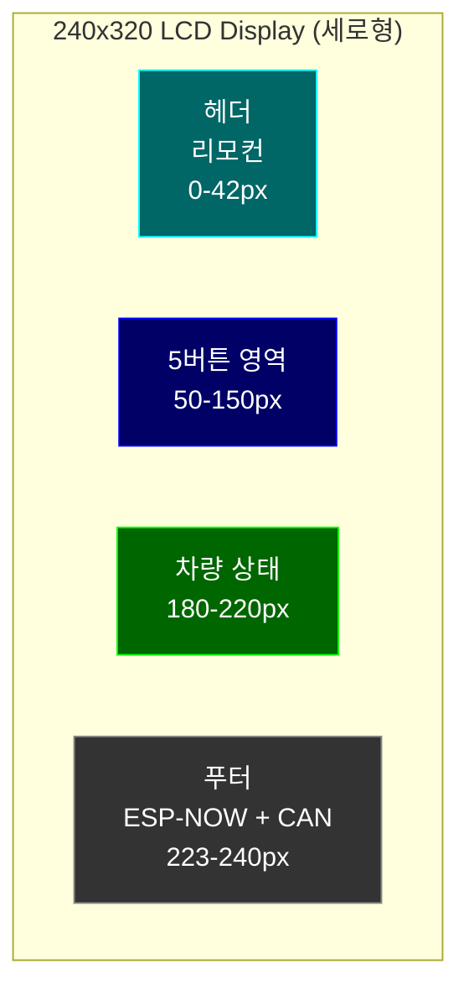
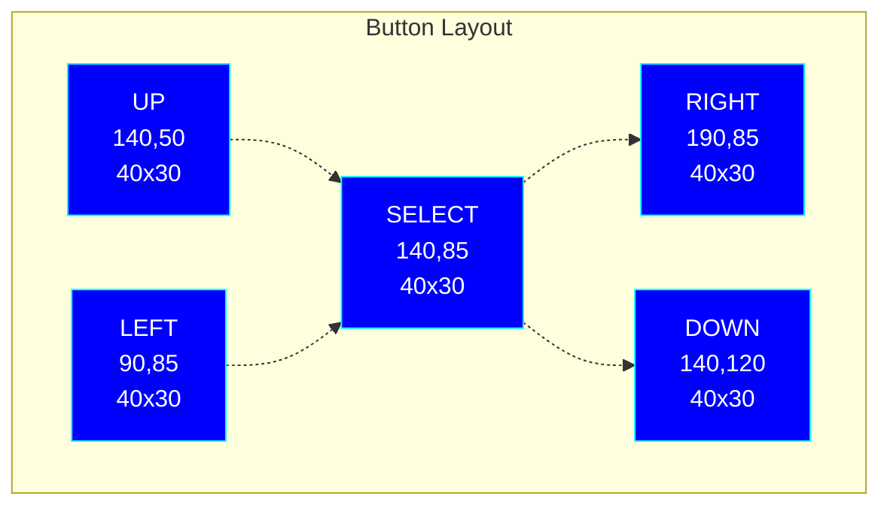
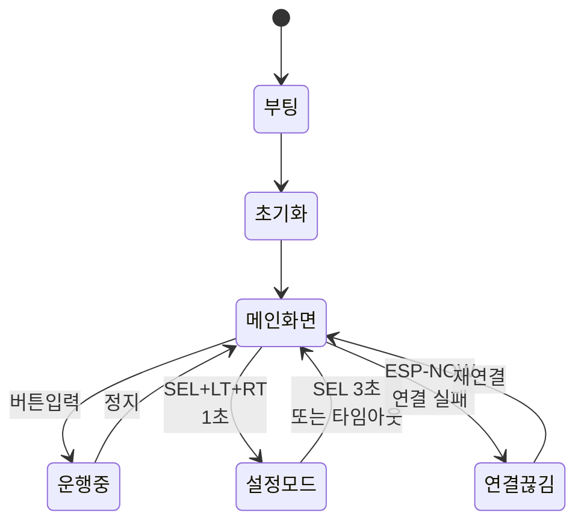
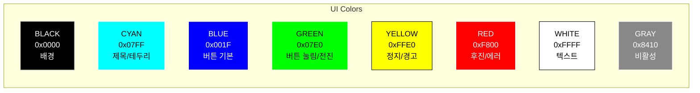
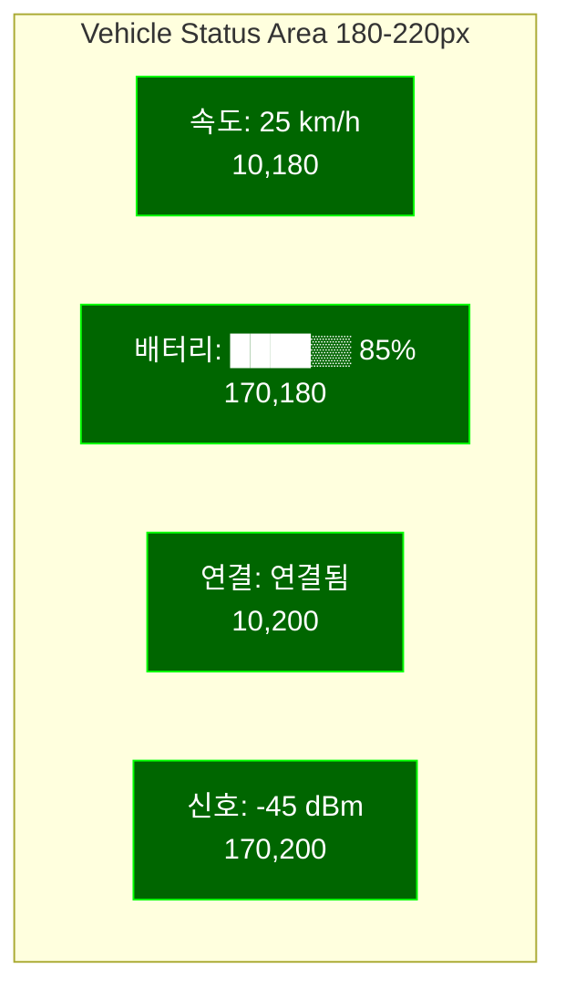
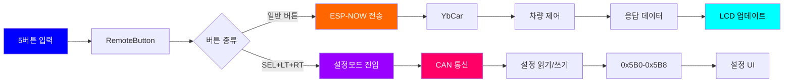
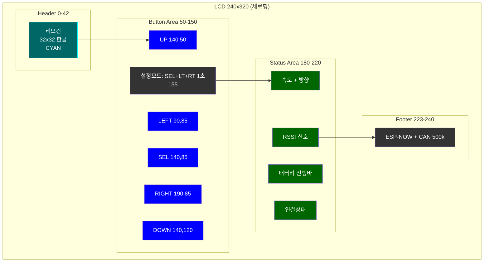
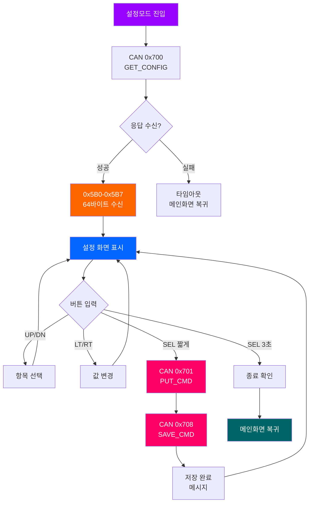
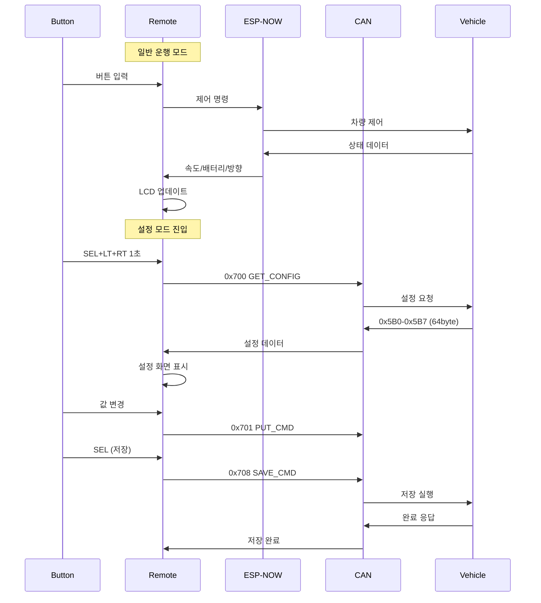
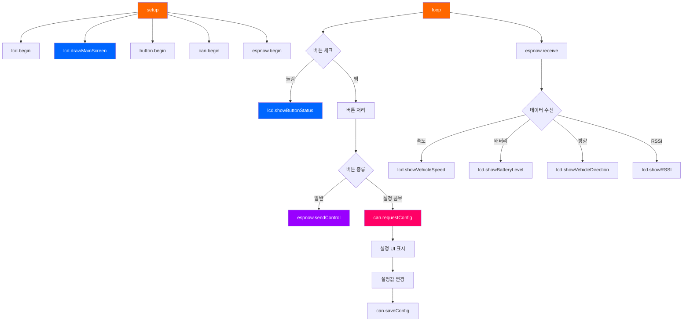

# ESP32 리모컨 UI 다이어그램

## 📱 메인 화면 레이아웃



## 🎮 5버튼 레이아웃



## 🔄 상태 전환 다이어그램



## 🎨 색상 팔레트



## 📊 차량 정보 영역



## 🔀 데이터 흐름



## 🖥️ 화면 구성 상세



## 🎯 설정모드 화면 구성



## 📡 통신 프로토콜



## 🔧 함수 호출 구조



---

## 📷 다이어그램 렌더링 방법

### VS Code에서 보기
1. **Markdown Preview Mermaid Support** 확장 설치
2. `Ctrl+Shift+V`로 미리보기

### GitHub에서 보기
- GitHub는 Mermaid를 자동으로 렌더링합니다

### 온라인 에디터
- https://mermaid.live/ 에서 편집/내보내기 가능
- PNG, SVG, PDF로 변환 가능

### 이미지로 변환
```bash
# Mermaid CLI 설치
npm install -g @mermaid-js/mermaid-cli

# PNG로 변환
mmdc -i docs/ui-diagram.md -o docs/ui-diagram.png
```
